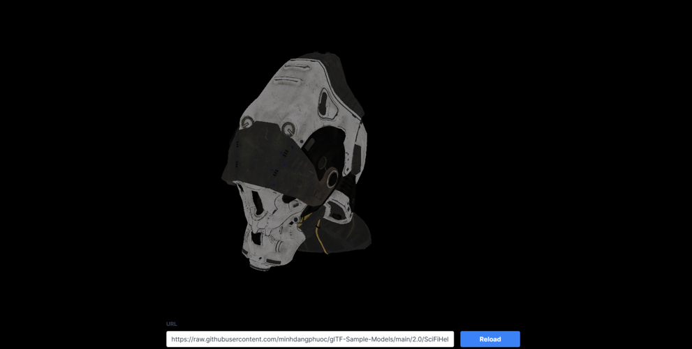

# thesis-3d-web-renderer



## Prerequisites

### Environment

``` shell

# In demo/package.json
# Window
"wasm:build":"cd ../engine/ && set RUSTFLAGS=--cfg=web_sys_unstable_apis ...",

# Other OSs
"wasm:build":"cd ../engine/ && RUSTFLAGS=--cfg=web_sys_unstable_apis ...",

```

### Dependences

``` shell
# Install Rust (www.rust-lang.org/tools/install)
# Install wasm-pack
## Linux and MacOS (rustwasm.github.io/wasm-pack/installer)
curl https://rustwasm.github.io/wasm-pack/installer/init.sh -sSf | sh
## All Platforms (requires Rust)
cargo install wasm-pack
# Install NodeJS (nodejs.org/en/download)
```

### Browsers

- Details of current-supported WebGPU Browsers
1. [caniuse.com/webgpu](https://caniuse.com/webgpu)
1. [developer.mozilla.org/en-US/docs/Web/API/WebGPU_API](https://developer.mozilla.org/en-US/docs/Web/API/WebGPU_API)

## Build & Run

``` shell
# 1. Go to web example directory
cd demo

# 2. Install package
npm install

# 3. Build
npm run build

# 3. Run
npm run start

# 4. [Optional] Dev
npm run dev

```